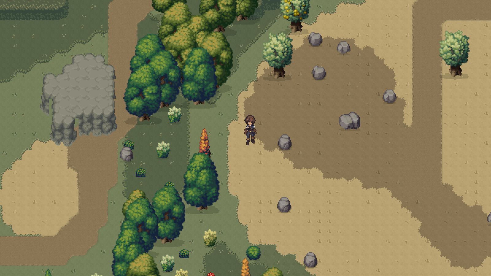

# Oathwake — terreno dark fantasy

Revisado em 7 de setembro de 2026 após o retorno sobre falta de acabamento nas bordas. O conjunto tem **18 folhas em PNG e PXO**: as 17 folhas de terreno/decoração e uma folha própria para a estrada. As cópias ficam em `assets/sprites/world/procedural/terrain/oathwake_tilesets/`; os originais continuam intactos, com cópias adicionais em `source_copies/`.

## Correção das bordas

A primeira recoloração havia achatado os valores claros e escuros das margens do chão. As cinco folhas de terreno foram revisadas para recuperar o relevo da borda a partir da diferença de luminosidade em relação ao material central, mantendo a paleta apagada e os encaixes de transparência.

A estrada usava um atlas geométrico de quatro vizinhos, com margens retas sem acabamento. Agora `oathwake_road.png/.pxo` contém 512 configurações dos oito vizinhos mais o centro, em quatro variações de cor. A ocupação filtrada arredonda curvas externas e preenche os cantos internos. Uma faixa fina de terra translúcida mistura a margem ao chão, e a variação de textura reduz a repetição do contorno. O atlas tem 256 × 2048 pixels, com peças de 16 × 16.

O desenho considera a terra adjacente como parte do mesmo material: a estrada se une às manchas de terra, sem terminar como uma placa retangular sobre elas. Isso altera somente a seleção visual dos tiles; rotas lógicas, larguras, seed e colisões continuam iguais. As imagens anteriores a esta correção estão em `edge-revision-before/`.

O acabamento gerado das falésias também deixava uma fileira pontilhada de sombra afastada dos pés irregulares da pedra. Essa fileira foi removida na versão Oathwake, mantendo o sombreamento da própria arte e as pequenas pedras no solo.

## Ver o resultado

Esta é uma captura do Godot usando a cena procedural de produção, mundo de 512 × 320 tiles e seed 74291. O Wayfarer foi colocado como personagem de demonstração. A captura usa uma viewport isolada e não carrega nem grava o save do jogador. A ampliação é 2× por vizinho mais próximo, sem filtro ou pintura sobre a imagem.

- `world-0-before.png` / `world-0-after.png`: mesma posição e geração, antes/depois.
- `world-1-after.png`: região central do mundo.
- `world-2-after.png`: região da floresta.
- `oathwake-atlas-review.png`: todas as folhas para inspeção.
- Os arquivos `*-native.png` guardam a resolução original da captura.

## Conteúdo

| Grupo | Arquivos PNG/PXO |
|---|---|
| Chão e transições | plainsgrass2, plainsgrass3, short_grass, plainsgrass1, tall_grass |
| Caminho da floresta | forest_path_short_grass_autumn |
| Falésias | plains_3D_cliffs |
| Barreiras florestais | forest_unbreakable_bushes_bottom_, forest_unbreakable_bushes_top_, tree_wall, canopy_ |
| Detalhes do solo | plainsgrass2_details, plainsgrass3_details, shortgrass_details |
| Decoração sem interação | flora_tiny_flowers, flora_tiny_ground_leaves, flora_ground_plants |
| Estrada e acabamento de margens | oathwake_road |

A paleta completa e os hashes estão em `oathwake-tilesets-manifest.json`. As bordas receberam tratamento de cor, textura e pequenas alterações internas de silhueta; os dois pixels externos de cada célula de chão mantêm a assinatura de transparência original para preservar o encaixe. As falésias mantêm as facetas e volumes do atlas, com nova paleta mineral. Árvores coletáveis, pedras, arbustos e outras entidades de recurso mantêm suas artes originais, conforme o escopo pedido.

## Aplicação no jogo e arquivos alterados

- `scenes/world/RomesteadProceduralGameWorld.tscn`: habilita `use_oathwake_tilesets` na cena de produção.
- `scripts/labs/romestead_systems/RomesteadBiomeWorld2D.gd`: carrega as cópias de terreno e as três folhas de decoração. Os endereços do atlas, a seed e as colisões permanecem iguais.
- `scripts/world/terrain/OathwakeTerrainPalette.gd`: harmoniza as cores das camadas de água, caminhos, detalhes e acabamento de falésias geradas em código.
- `scripts/systems/ProceduralWorldAugment.gd`: aplica essa paleta quando a opção Oathwake está ativa, preservando transparência e geometria.
- `scripts/world/terrain/OathwakeRoadEdges.gd`: escolhe os tiles da estrada pelos oito vizinhos e une seu acabamento ao terreno de terra. `ProceduralWorldAugment.gd` passa a usar o atlas autoral quando a opção Oathwake está ativa, preservando a geração da rota.

Para testar no Godot, execute o projeto com **F5** e entre no mundo. A cena `scenes/maps/StartArea.tscn` já instancia a cena procedural com o novo visual. Para comparar com os originais, desmarque **Use Oathwake Tilesets** na raiz de `RomesteadProceduralGameWorld.tscn` e reinicie a execução. Não é necessário alterar a seed.

## Verificação e reprodução

- `terrain-asset-qa.json`: 18 folhas com dimensões corretas, PNG exportado após reabertura do PXO igual ao RGBA esperado, originais preservados e 42.560 comparações de transparência nas bordas aprovadas.
- `road-edge-qa.json`: curvas de uma, duas e três células de largura e cruzamento em T reconstruídos a partir do PNG exportado; conectividade dos pixels e ausência de buracos verificadas. As quatro variações possuem transparência idêntica para não criar emendas.
- `terrain-runtime-validation.json`: 256 máscaras e 1.572 seleções de peças verificadas, sem falhas. Também verifica carregamento da arte, preservação de recursos e regras de colisão.
- `scripts/test/OathwakeTerrainStyleReview.gd`: revisão controlada de ilhas, cantos, buracos e colisões no Godot.
- `road-edge-review.png`: curva, extremidades e união da estrada com a terra no renderizador real. O teste também confirma que a rota lógica não é alterada e que a estrada não adiciona colisores.
- `scripts/test/OathwakeTerrainWorldCapture.gd`: gera as capturas reais antes/depois sem salvar uma sessão de jogo.
- `tools/verify_oathwake_terrain.py`: confere os arquivos e atualiza as pranchas e ampliações.

A autoria passou pelo Pixelorama MCP, com PNG e projeto PXO editável por folha. `tools/author_oathwake_terrain.py` e `tools/author_oathwake_road.py` preparam os pedidos e `tools/character_pixelorama.py` os executa. Não execute novamente a autoria sobre edições manuais sem revisar os pedidos: ela reconstitui as folhas de forma determinística.

Foi validada a execução local no Godot 4.6.3, com renderer Compatibility. As capturas cobrem três regiões e uma cena de encaixes; não equivalem a uma inspeção visual de toda seed possível. O aviso do MultiFloorBuildManager sobre ausência de BuildSystem pertence à inicialização isolada de revisão e não impediu as capturas.

O mapa técnico do projeto e as descobertas reutilizáveis estão na skill `C:/Users/ramon/.codex/skills/oathwake/SKILL.md`, especialmente `references/terrain.md`.
